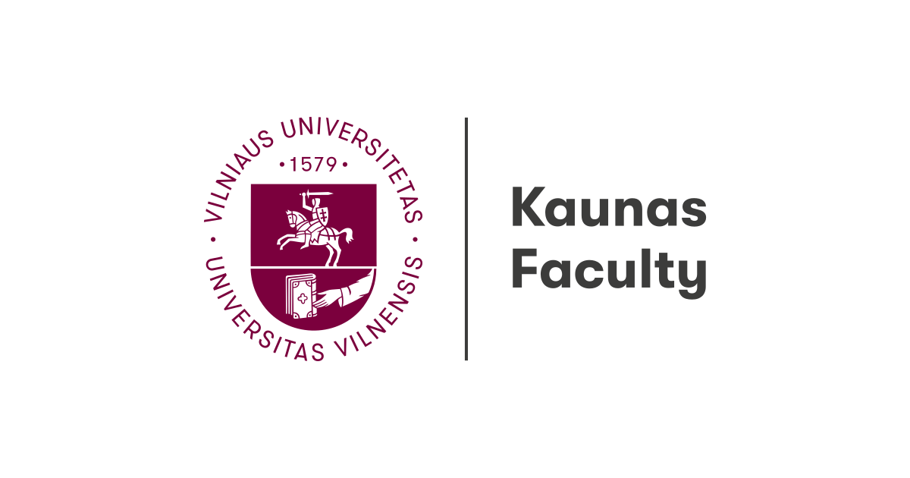

<br clear="left"/>

# YouTube Spam Detection (NLP)

Machine Learning project for spam detection in YouTube comments using  
Natural Language Processing techniques.

Developed during my Erasmus exchange as part of the  
*Basics of Artificial Intelligence* course.

---

## Methods

- Text preprocessing (lowercasing, stopwords removal)
- Feature extraction: Bag-of-Words, TF-IDF
- Models: Naive Bayes, Logistic Regression, SVM

---

## Results

- Best model: **SVM + TF-IDF**
- Accuracy: **96%**

---

## Tech Stack

- Python
- scikit-learn
- pandas
- numpy
- matplotlib
- seaborn
- nltk

---

## Run

```bash
pip install -r requirements.txt
python spam.py
